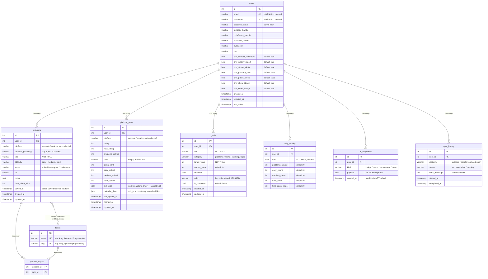

# DSA Tracker — Database Schema v2

> **Version:** 2.0 — Frozen architecture. Build models and migrations against this.
> **Rated:** 9.8/10 after architectural improvements applied below.

## Entity Relationship Diagram



---

## Table-by-Table Breakdown

### `users` — Core identity
The root table. Everything cascades from here.

| Column | Type | Notes |
|--------|------|-------|
| `id` | SERIAL PK | Auto-increment |
| `email` | VARCHAR(255) | UNIQUE, NOT NULL |
| `username` | VARCHAR(80) | UNIQUE, NOT NULL |
| `password_hash` | VARCHAR(255) | bcrypt output (~60 chars) |
| `leetcode_handle` | VARCHAR(100) | Nullable — user sets in Settings |
| `codeforces_handle` | VARCHAR(100) | Nullable |
| `codechef_handle` | VARCHAR(100) | Nullable |
| `avatar_url` | VARCHAR(500) | Nullable |
| `bio` | VARCHAR(280) | Twitter-style bio |
| `pref_*` (7 cols) | BOOLEAN | All NOT NULL with server_default |
| `created_at` | TIMESTAMP | Auto |
| `updated_at` | TIMESTAMP | Auto |
| `last_active` | TIMESTAMP | Touch on activity |

**Key decisions:**
- Preferences as individual boolean columns — queryable, individually defaultable, no JSON parsing overhead.
- `updated_at` added (v2) — essential for debugging and future sync logic.

---

### `problems` — The core tracking table
Every solved/attempted/bookmarked problem is a row here.

| Column | Type | Notes |
|--------|------|-------|
| `id` | SERIAL PK | Auto-increment |
| `user_id` | INT FK | → users.id, CASCADE DELETE |
| `platform` | VARCHAR(30) | `"leetcode"` / `"codeforces"` / `"codechef"` — lowercase only |
| `platform_problem_id` | VARCHAR(100) | Platform-specific ID — `"1"` (LC), `"4A"` (CF), `"FLOW001"` (CC) |
| `title` | VARCHAR(300) | NOT NULL |
| `difficulty` | VARCHAR(20) | `"easy"` / `"medium"` / `"hard"` |
| `status` | VARCHAR(20) | `"solved"` / `"attempted"` / `"bookmarked"` |
| `url` | VARCHAR(500) | Original problem URL |
| `notes` | TEXT | User's personal notes and observations |
| `time_taken_mins` | INT | Optional manual tracking |
| `solved_at` | TIMESTAMP | Original solve timestamp from platform |
| `created_at` | TIMESTAMP | Auto on row creation |
| `updated_at` | TIMESTAMP | Auto on every update |

**Why separate `solved_at` and `created_at`?**
Imported problems carry their original submission timestamp.
`solved_at` = when they solved it on the platform. `created_at` = when it entered your database.

**Why `platform_problem_id`?**
Titles can change on platforms. A stable ID gives us a durable reference and prevents duplicate imports during sync. `VARCHAR(100)` accommodates all platform formats.

**Unique constraint:** `(user_id, platform, platform_problem_id)` — one user cannot import the same problem twice.

**Why no "Not Attempted" status?**
A problem the user never touched shouldn't be a row. Only `solved`, `attempted`, and `bookmarked` make sense.

---

### `topics` — Canonical topic list
A simple lookup table for problem tags.

| Column | Type | Notes |
|--------|------|-------|
| `id` | SERIAL PK | Auto-increment |
| `name` | VARCHAR(100) | UNIQUE — display name e.g. `"Array"`, `"Dynamic Programming"` |
| `slug` | VARCHAR(100) | UNIQUE — URL-safe identifier e.g. `"array"`, `"dynamic-programming"` |

Pre-seeded with ~30 standard DSA topics on first migration.

**Why `slug`?**
The `name` is for display (`"Dynamic Programming"`). The `slug` is for filtering, URL params, and API queries (`"dynamic-programming"`). Keeps the frontend clean.

---

### `problem_topics` — Many-to-many join
Links problems to their topics. One problem can have multiple tags.

| Column | Type | Notes |
|--------|------|-------|
| `problem_id` | INT FK | → problems.id, CASCADE DELETE |
| `topic_id` | INT FK | → topics.id, CASCADE DELETE |

**Composite PK:** `(problem_id, topic_id)` — no duplicates.

**Why normalize topics?**
A single `topic` column gives you `"Array"` for Two Sum — but it's also `"Hash Table"`.
Proper many-to-many gives accurate analytics:
- Topic distribution chart counts each tag independently
- Strength/weakness bars reflect true topic exposure

---

### `platform_stats` — Cached external API data
**The most important design decision in the schema.**

| Column | Type | Notes |
|--------|------|-------|
| `user_id` | INT FK | → users.id, CASCADE DELETE |
| `platform` | VARCHAR(50) | ✨ `"leetcode"` / `"codeforces"` (lowercase) — one row per platform per user |
| `rating` | INT | Current contest rating |
| `max_rating` | INT | All-time peak |
| `problems_solved` | INT | Total from the platform |
| `rank` | VARCHAR(50) | `"Knight"`, `"Bronze"` etc. |
| `global_rank` | INT | LeetCode global rank number |
| `easy_solved` | INT | |
| `medium_solved` | INT | |
| `hard_solved` | INT | |
| `skill_data` | JSON | `[{topic, solved, level, score}, ...]` — cached blob |
| `calendar_data` | JSON | `{"1706745600": 3, ...}` (unix_ts → count) — cached blob |
| `last_synced_at` | TIMESTAMP | When Sync was last clicked |
| `fetched_at` | TIMESTAMP | Auto on creation |
| `updated_at` | TIMESTAMP | ✨ Added v2 — touch on each upsert |

**Unique constraint:** `(user_id, platform)` — one row per platform per user. Updated via upsert on each sync.

**Why keep `skill_data` and `calendar_data` as JSON?**
These are read-only blobs from external APIs. We never query inside them with SQL — we fetch the whole row and parse in Python/JS. JSON is the correct choice; normalizing into SQL rows adds complexity with zero benefit.

**Data flow:**
```
Dashboard → PostgreSQL → [if stale] → Sync Job → LeetCode API → PostgreSQL
```
Much faster than hitting LeetCode on every dashboard refresh.

---

### `goals` — Target tracking

| Column | Type | Notes |
|--------|------|-------|
| `user_id` | INT FK | → users.id, CASCADE DELETE |
| `title` | VARCHAR(300) | `"Solve 100 problems this month"` |
| `category` | VARCHAR(50) | `"problems"` / `"rating"` / `"learning"` / `"topic"` |
| `target_value` | INT | e.g. 100 |
| `current_value` | INT | Manually incremented via +/- buttons |
| `deadline` | DATE | Optional |
| `color` | VARCHAR(20) | Hex, for UI card accent |
| `is_completed` | BOOLEAN | Auto-set when current ≥ target |
| `created_at` | TIMESTAMP | |
| `updated_at` | TIMESTAMP | ✨ Added v2 — touch on every edit |

**Note:** Progress is manually tracked — not auto-computed from problems. Intentional: goals can be anything (rating targets, custom challenges, finishing a course), not just problem count.

---

### `daily_activity` — Streak + heatmap engine

| Column | Type | Notes |
|--------|------|-------|
| `user_id` | INT FK | → users.id, CASCADE DELETE |
| `date` | DATE | NOT NULL, indexed |
| `problems_solved` | INT | Total problems solved that day — default 0 |
| `easy_count` | INT | ✨ Easy problems solved that day — default 0 |
| `medium_count` | INT | ✨ Medium problems solved that day — default 0 |
| `hard_count` | INT | ✨ Hard problems solved that day — default 0 |
| `time_spent_mins` | INT | Manual or imported practice time — default 0 |

**Unique constraint:** `(user_id, date)` — one row per day per user.

**Written from 2 places:**
1. When user manually adds a Solved problem → today's row gets `+1` on `problems_solved` and the matching difficulty count
2. When platform submissions are imported → each submission's date row is upserted

**Why add difficulty counts?**
Instead of recalculating daily difficulty from hundreds of problems on every request, the analytics page can instantly build:
- Daily difficulty chart
- Weekly difficulty trend
- Monthly breakdown
- Practice intensity graph

**Streak calculation** (done in Python, not SQL):
```python
today = date.today()
streak = 0
check = today
while check in activity_dates:
    streak += 1
    check -= timedelta(days=1)
```

**Powers:** heatmap · streak counter · activity graph · weekly stats · monthly stats · daily difficulty charts

---

### `ai_responses` — Gemini output cache

| Column | Type | Notes |
|--------|------|-------|
| `user_id` | INT FK | → users.id, CASCADE DELETE |
| `kind` | VARCHAR(30) | `"insight"` / `"report"` / `"recommend"` / `"roast"` |
| `payload` | JSON | Full JSON object returned to the client |
| `created_at` | TIMESTAMP | Checked against 24h TTL |

**Cache logic (Python):**
```python
CACHE_TTL = timedelta(hours=24)

row = AIResponse.query\
    .filter_by(user_id=user_id, kind=kind)\
    .order_by(AIResponse.created_at.desc())\
    .first()

if row and (datetime.utcnow() - row.created_at) < CACHE_TTL:
    return row.payload  # serve cached

# else: call Gemini, store new row, return it
```

New rows are **appended** (not updated) — gives you a free history of all AI responses.

**Benefits:** cheaper AI usage · faster responses · historical AI reports

---

### `sync_history` — Platform sync audit log
*(Planned for v1.1 — schema included now, activate when sync job is built)*

| Column | Type | Notes |
|--------|------|-------|
| `id` | SERIAL PK | Auto-increment |
| `user_id` | INT FK | → users.id, CASCADE DELETE |
| `platform` | VARCHAR(30) | `"leetcode"` / `"codeforces"` / `"codechef"` |
| `status` | VARCHAR(20) | `"success"` / `"failed"` / `"running"` |
| `started_at` | TIMESTAMP | Sync start time |
| `completed_at` | TIMESTAMP | Sync completion time — NULL while running |
| `error_message` | TEXT | Error details if sync failed — NULL on success |

**Use cases:**
- Debug sync failures
- Display "Last synced 2 hours ago" in the UI
- Retry failed syncs
- Audit trail for data freshness

**UI example:**
```
Last Sync
✓ Successful   14 July 19:42

× API Rate Limited   (failed)
```

---

## Platform & Difficulty Enums

All enum-like values stored as **lowercase strings**. The UI layer handles display formatting.

```python
class Platform:
    LEETCODE   = "leetcode"
    CODEFORCES = "codeforces"
    CODECHEF   = "codechef"

class Difficulty:
    EASY   = "easy"
    MEDIUM = "medium"
    HARD   = "hard"

class ProblemStatus:
    SOLVED     = "solved"
    ATTEMPTED  = "attempted"
    BOOKMARKED = "bookmarked"

class SyncStatus:
    SUCCESS = "success"
    FAILED  = "failed"
    RUNNING = "running"
```

**Rule:** DB stores `"leetcode"`, frontend displays `"LeetCode"`. Never store display strings in the database.

---

## API Design Philosophy

The backend will **never expose database models directly**. Every response goes through a serializer.

```
User Model
    │
    ▼
Serializer
    │
    ▼
camelCase JSON
    │
    ▼
Frontend
```

This gives complete freedom to change the database later without breaking the frontend. Column renames, table splits, type changes — none of these affect the API contract.

---

## Folder Structure

```
backend/
│
├── models/          ← SQLAlchemy models (one file per table)
├── routes/          ← Flask Blueprints (one file per resource)
├── services/        ← Business logic layer (sync, streak, scoring)
├── serializers/     ← Model → camelCase JSON
├── utils/           ← Helpers (auth, pagination, date math)
├── migrations/      ← Alembic auto-generated files
│
├── app.py           ← App factory
├── config.py        ← Environment config (dev / prod)
├── extensions.py    ← db, migrate, jwt instances
└── requirements.txt
```

**Why this structure?**
Scalable enough for a project that grows beyond simple CRUD. `services/` keeps route handlers thin. `serializers/` decouples the DB from the API contract.

---

## Relationships Summary

```
users
  ├── problems        (1 → many)  cascade delete  [unique: user+platform+platform_problem_id]
  │     └── problem_topics  (many-to-many via topics)
  ├── platform_stats  (1 → many)  cascade delete  [unique: user+platform]
  ├── goals           (1 → many)  cascade delete
  ├── daily_activity  (1 → many)  cascade delete  [unique: user+date]
  ├── ai_responses    (1 → many)  cascade delete
  └── sync_history    (1 → many)  cascade delete

topics
  └── problem_topics  (1 → many)  cascade delete
```

All child tables use `CASCADE DELETE` — deleting a user removes everything.

---

## Migration History

| # | Migration | Changes |
|---|-----------|---------|
| 1 | `initial_schema` | `users`, `problems`, `platform_stats`, `goals`, `daily_activity` |
| 2 | `add_cached_fields_to_platform_stat` | Added `skill_data`, `calendar_data`, `last_synced_at` to `platform_stats` |
| 3 | `add_ai_responses_table` | Created `ai_responses` |
| 4 | `add_user_preference_columns` | Added 7 `pref_*` boolean columns to `users` |
| 5 | `normalize_topics_many_to_many` | Created `topics` (with `slug`) + `problem_topics`; dropped `topic` column from `problems` |
| 6 | `add_platform_problem_id` | Added `platform_problem_id VARCHAR(100)` to `problems`; unique constraint `(user_id, platform, platform_problem_id)` |
| 7 | `add_updated_at_columns` | Added `updated_at` to `users`, `problems`, `platform_stats`, `goals` |
| 8 | `lowercase_enum_values` | Data migration: normalize platform/difficulty/status to lowercase |
| 9 | `add_sync_history_table` | Created `sync_history` |
| 10 | `add_daily_activity_difficulty_counts` | Added `easy_count`, `medium_count`, `hard_count` to `daily_activity` |

> [!IMPORTANT]
> **Rule when adding NOT NULL columns to existing tables:**
> Always use `server_default` in the migration or the upgrade will fail on existing rows.

---

## Indexes

```sql
-- Auto-created by SQLAlchemy (FK columns):
problems(user_id)
platform_stats(user_id)
goals(user_id)
daily_activity(user_id)
ai_responses(user_id)
sync_history(user_id)
problem_topics(problem_id)
problem_topics(topic_id)

-- Explicit indexes to add:
CREATE UNIQUE INDEX idx_platform_stats_unique  ON platform_stats(user_id, platform);
CREATE UNIQUE INDEX idx_daily_activity_unique  ON daily_activity(user_id, date);
CREATE UNIQUE INDEX idx_problems_platform_id   ON problems(user_id, platform, platform_problem_id);

CREATE INDEX idx_problems_platform    ON problems(user_id, platform);
CREATE INDEX idx_problems_status      ON problems(user_id, status);
CREATE INDEX idx_problems_difficulty  ON problems(user_id, difficulty);
CREATE INDEX idx_activity_date        ON daily_activity(user_id, date DESC);
CREATE INDEX idx_ai_kind_created      ON ai_responses(user_id, kind, created_at DESC);
CREATE INDEX idx_sync_history_recent  ON sync_history(user_id, platform, started_at DESC);
```

---

## What Was Kept From v1

| Decision | Rationale |
|----------|-----------|
| `platform_stats` as a cache | Avoids hitting external APIs on every dashboard load |
| `daily_activity` as a single table | Powers heatmap + streak + weekly/monthly analytics from one place |
| `ai_responses` append-only | Cheap caching + free response history |
| `goals` independent of problems | Goals can be anything — rating, courses, custom targets |
| `skill_data` + `calendar_data` as JSON | Read-only API blobs. No SQL queries inside them. JSON is correct. |
| Individual `pref_*` columns | Individually queryable and defaultable. Simpler than a JSON blob. |

## What Changed From v1

| Change | Why |
|--------|-----|
| `topic` (single column) → `topics` + `problem_topics` | One problem can have multiple tags. Accurate analytics. |
| Added `platform_problem_id VARCHAR(100)` | Stable platform reference. Prevents duplicate imports. |
| Added `slug` to `topics` | Clean URL params and API filtering without reformatting display names. |
| Lowercase enum values | DB stores canonical values; UI decides display format. |
| `platform VARCHAR(30)` (was 50) | Tighter constraint — only 3 known values, max 10 chars. |
| `"Not Attempted"` status removed | Problems the user never touched shouldn't be rows. |
| `updated_at` added to 4 tables | Debugging, sync logic, auditing. |
| `easy_count` / `medium_count` / `hard_count` in `daily_activity` | Instant daily difficulty charts without recalculating from problem rows. |
| Added `sync_history` | Audit trail for sync jobs; powers "Last synced X ago" UI. |
| API serializer layer locked in | DB changes never break the frontend contract. |
